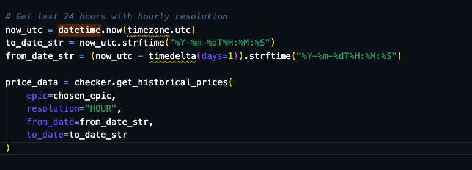

# 1. problem that we have 
📊 Using epic: GOLD

📈 Fetching historical data for GOLD...
Price API response status: 400
API Error: Status 400
Response: **{"errorCode":"error.invalid.daterange"}** <= here is the main problem 
❌ Failed to retrieve price data
This could be due to:
   - Incorrect epic symbol
   - Market closed
   - Date range issues
   - API limitations

🎉 Complete! Your Capital.com API integration is working. 

### How to solve it?
Gemini Response :
""
Based on the documentation and common API behavior, the problem is almost certainly a combination of two things:

Timezones: APIs almost always require dates and times to be in universal coordinated time (UTC). Your current script uses datetime.datetime.now(), which uses your computer's local time.
Conflicting Parameters: You are providing max, from, and to all at the same time. This can confuse the API, as it doesn't know whether to give you the last max data points OR all the data points between from and to.
""

### What i did? 

we changed this line 

and we have this output 

📈 Fetching historical data for GOLD...
Traceback (most recent call last):
  File "/Users/daniilbystrov/Desktop/Programming/Programs/SWF4/capital_request.py", line 272, in <module>
    main()
    ~~~~^^
  File "/Users/daniilbystrov/Desktop/Programming/Programs/SWF4/capital_request.py", line 236, in main
    now_utc = datetime.now(timezone.utc)
              ^^^^^^^^^^^^
**AttributeError: module 'datetime' has no attribute 'now' <= here is the main problem  for now**
venvdaniilbystrov@Daniils-MacBook-Pro SWF4 % 

And solution i made myself 
1. went to google.com 
2.  then here - https://www.freecodecamp.org/news/python-datetime-now-how-to-get-todays-date-and-time/ 
3. and i looked and AHA
"
import http.client
import json
import datetime
from typing import Dict, List, Optional, Tuple 
" 
that's our import 

and i just made this 

import http.client
import json
from datetime import timezone, timedelta, datetime <= here we can see the difference
from typing import Dict, List, Optional, Tuple

and woala 

📈 SAMPLE DATA POINTS:
Time                 Open       High       Low        Close     
----------------------------------------------------------------------
2025-06-19T12:00:00  3365.81    3371.52    3362.19    3368.61   
2025-06-19T13:00:00  3368.59    3373.59    3363.61    3370.24   
2025-06-19T14:00:00  3370.26    3379.10    3369.05    3374.90   
2025-06-19T15:00:00  3374.93    3375.41    3370.38    3371.94   
2025-06-19T16:00:00  3371.93    3372.56    3363.73    3367.90   

🔍 PRICE MATCHING VERIFICATION:
✅ Authentication: Working
✅ API Connection: Working
✅ Data Retrieval: Working
✅ Price Structure: Valid
✅ Historical Data: Available

# 2. problem that we have  "Login error: expected string or bytes-like object, got 'NoneType"

тут просто оказалось расхожджения имен в env файле и в data_pipeline.py

